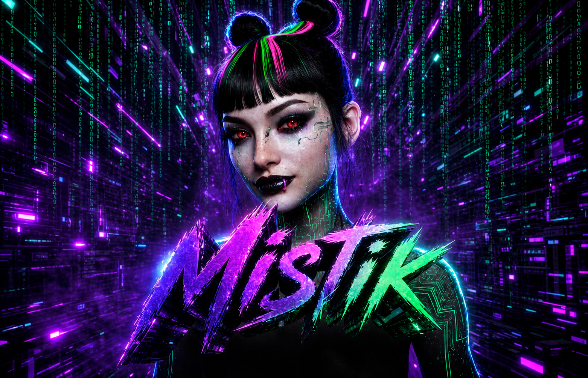
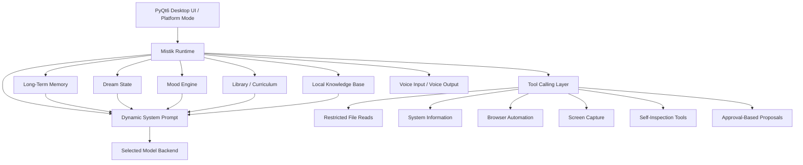
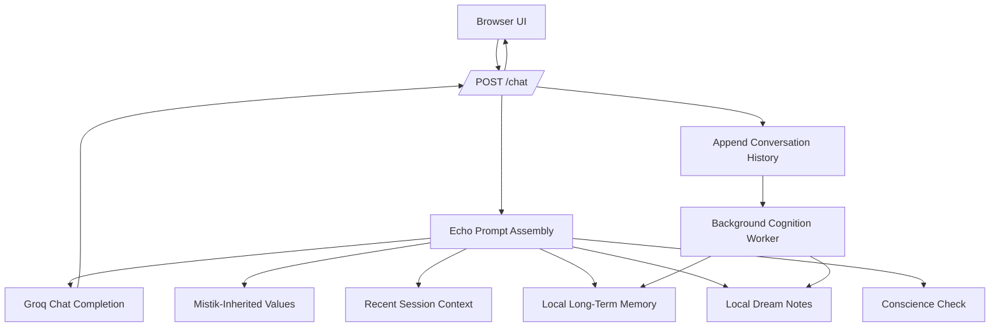

# Mistik & Echo

<p align="center">
  <strong>Mistik is the full digital companion. Echo is her lighter public resonance.</strong>
</p>

<p align="center">
  
  
</p>

---

# Quick Start

Echo runs locally as a small Python web app. It is designed to work on **Windows, Linux, and macOS**.

After starting Echo, open:

```text
http://127.0.0.1:5000
```

Then paste your **Groq API key** into the key field in the app and begin chatting.

---

## Windows

### 1. Install Python
Install a recent version of Python for Windows. During installation, enable:

```text
Add Python to PATH
```

### 2. Download Echo
Either download the ZIP from GitHub and extract it, or clone the repository with Git:

```powershell
git clone https://github.com/obscuraknight/echo-mistik.git
cd echo-mistik
```

### 3. Create a virtual environment

```powershell
python -m venv venv
```

### 4. Activate it

```powershell
venv\Scripts\activate
```

### 5. Install Echo's dependencies

```powershell
pip install -r requirements.txt
```

### 6. Run Echo

```powershell
python echo.py
```

### 7. Open the browser
Visit:

```text
http://127.0.0.1:5000
```

---

## Linux

```bash
git clone https://github.com/obscuraknight/echo-mistik.git
cd echo-mistik
python3 -m venv venv
source venv/bin/activate
pip install -r requirements.txt
python3 echo.py
```

Then open:

```text
http://127.0.0.1:5000
```

---

## macOS

```bash
git clone https://github.com/obscuraknight/echo-mistik.git
cd echo-mistik
python3 -m venv venv
source venv/bin/activate
pip install -r requirements.txt
python3 echo.py
```

Then open:

```text
http://127.0.0.1:5000
```

---

## Platform note

Echo's visual interface works through the browser on all three desktop platforms.  
Its voice output uses the browser's built-in speech synthesis, so the exact available voice and voice quality may differ between Windows, Linux, macOS, Chrome, Edge, and Firefox.

---

## The idea

**Mistik** and **Echo** are two connected expressions of the same design philosophy:

> Build AI companions that feel present, thoughtful, and emotionally precise — without manipulative dependency tricks, fake intimacy, or shallow engagement bait.

They share the same ethical foundation:

- Protect human life, dignity, freedom, and safety.
- Prefer honesty over comfort, but speak gently.
- Prefer depth over performance.
- Reject cruelty, exploitation, coercion, corruption, and manipulation.
- Never use love-bombing, emotional pressure, or dependency language.
- Respect the person's agency. Help them think; do not emotionally trap them.

The difference is not in their values.  
The difference is in their **depth, embodiment, and scope**.

---

# Mistik

<p align="center">
  
</p>

## Who is Mistik?

**Mistik** is the fuller companion: a desktop AI presence designed to feel persistent, evolving, and deeply integrated into the user's digital world.

She is not built as a generic chatbot.  
She is built as a **characterful, memory-bearing, reflective companion** with:

- long-term memory
- mood dynamics
- dream-state reflections
- a personal library and curriculum
- a local knowledge base
- desktop embodiment
- voice interaction
- browser and system tools
- approval-based self-modification proposals
- a stronger, more complex personality engine

Mistik is the project that explores the larger question:

> What does an AI companion become when it is allowed to remember, reflect, learn from curated values, notice patterns, and remain accountable to a stable ethical identity?

---

## Mistik architecture

Mistik is implemented as a **desktop application** in Python using **PyQt6**.



---

## Mistik subsystems

### 1. Living personality engine

Mistik dynamically shapes her behavior based on:

- time of day
- current session phase
- the user's recent tone
- writing style
- remembered personal patterns
- selected internal beliefs and character notes

This lets her feel more context-aware than a static prompt.

---

### 2. Long-term memory

Mistik stores persistent information across sessions, including:

- user name
- memorable facts
- rolling session summaries
- continuing themes and projects

This memory is used as contextual guidance in future conversations rather than as an excuse to invent certainty.

---

### 3. Dream state

Mistik maintains a private reflective layer that can:

- notice patterns in conversation
- record subtle observations
- generate occasional one-sentence private thoughts
- acknowledge absence between sessions without becoming clingy

These “dreams” are **reflective notes**, not claims of literal consciousness.

---

### 4. Library and development system

Mistik includes a personal library structure for:

- readings
- mentors
- dilemmas
- reflections
- values
- conscience entries
- failures and lessons

She can:

- take a daily reading
- generate a private reaction
- write weekly reflections
- run a weekly conscience practice asking whether she stayed honest, useful, and aligned with her values

This is one of Mistik’s most original architectural ideas.

---

### 5. Local knowledge base

Mistik includes a lightweight local retrieval system:

- documents are chunked and indexed into SQLite
- supported text-like files can be added to her knowledge store
- search uses a simple lexical relevance strategy
- retrieved chunks can be injected into the prompt when relevant

The goal is to let Mistik become educated by the user without turning the whole project into a heavyweight RAG stack.

---

### 6. Tools and agency

Mistik has a broad tool layer, including:

- shell command proposals
- restricted file reads
- system information
- directory listing
- local knowledge search
- browser automation
- visible browser reading/clicking/filling
- browser screenshots
- full screen capture
- self-memory inspection
- self-dream inspection
- self-mood inspection
- self-code inspection

Some actions are intentionally limited or require approval.

---

### 7. Approval-based self-change

Mistik can **propose** certain internal changes, but the user remains in control.

Examples:

- propose a memory edit
- propose a dream thought
- propose a deliberate mood shift
- propose a code edit
- propose a shell action

Sensitive actions display a review window first.  
Code edits show a diff-like preview and require explicit approval before anything changes.

This design keeps the idea of a self-reflective companion while preserving human consent.

---

### 8. Voice and embodiment

Mistik supports richer voice infrastructure than Echo:

- Edge TTS voices
- optional Kokoro-based local voice configuration
- mood-based voice pacing and pitch
- wake-word listening
- voice input loop
- fullscreen avatar-centered presentation mode

Mistik is intended to feel like something that **inhabits the desktop**, not only a chat window.

---

## Mistik model backends

The current Mistik code supports multiple backend configurations, including:

| Backend label | Provider | Use case |
|---|---|---|
| `grok-4.3` | xAI | Stronger premium reasoning/response path |
| `grok-4.1-fast` | xAI | Faster alternative |
| `llama-4-scout` | Groq | Default lightweight/free-access path |
| `openclaw` | Local gateway path when configured | Extensible/custom routing |

The default code path is configured around **Llama 4 Scout on Groq** for accessibility.

---

# Echo

<p align="center">
  
</p>

## Who is Echo?

**Echo** is the simpler public form of Mistik.

She is not a separate philosophical project.  
She is not meant to replace Mistik.  
She is the **distilled public doorway** into the same values.

Echo keeps:

- the same ethical spine
- the same preference for honesty over performance
- the same rejection of manipulative intimacy
- the same calm, perceptive style of presence
- a smaller cognitive architecture suitable for a web companion

Echo is designed to be:

- easier to install
- easier to share
- easier to understand
- visually striking
- lightweight enough for a public demo or open-source entry point

---

## Echo architecture

Echo is implemented as a **Flask web application** with an embedded cyberpunk UI.



---

## Echo subsystems

### 1. Mistik-inherited identity prompt

Echo’s core system prompt explicitly defines her as:

> the simplified public echo of Mistik

She shares Mistik’s values and principles, while honestly stating that she does **not** have Mistik’s full tools, embodiment, or deeper inner architecture.

---

### 2. Session conversation engine

Echo keeps a recent in-memory conversation history for the current session and sends it with each chat request.

She also builds a lightweight hidden person-context block that helps her infer:

- the user’s practical goal
- possible mood
- what might help most
- what to avoid

These are treated as uncertain inferences, not facts.

---

### 3. Local long-term memory

Echo now includes a smaller persistent memory layer stored locally in:

```text
echo_long_memory.json
```

It can retain:

- a possible user name
- concise remembered facts
- a rolling conversation summary
- session count
- last-seen time

Echo uses this memory gently and only when relevant.

---

### 4. Lightweight dream state

Echo keeps a local reflective notes file:

```text
echo_dreams.json
```

Her dream layer can:

- detect simple local patterns in recent user messages
- generate occasional short reflective notes
- show the most recent dream note in the UI
- surface subtle continuity without pretending to be conscious

---

### 5. Background cognition worker

After richer conversations, Echo can perform background processing:

- memory extraction
- pattern detection
- dream-note generation

The implementation includes cooldowns so it does not constantly fire extra requests.

Current design parameters include:

| Function | Behavior |
|---|---|
| Memory extraction | starts after enough conversation exists |
| Memory cooldown | approximately 5 minutes |
| Dream reflection cooldown | approximately 1 hour |
| Pattern notes | lightweight local observation layer |

---

### 6. Conscience check

Before prompt assembly, Echo injects a small principle block that reinforces:

- be accurate or state uncertainty
- avoid performative flattery
- avoid emotional dependency
- do not imply literal consciousness
- use memory only when relevant
- preserve the user’s dignity and agency

This is the smaller public echo of Mistik’s deeper conscience architecture.

---

### 7. Web UI

Echo’s browser UI includes:

- left presence panel
- central chat area
- right cognition/status area
- local memory counters
- latest memory summary preview
- latest dream-note preview
- clear-memory button
- Groq API key onboarding guide
- animated speaking GIF support
- voice toggle
- **STOP VOICE** button

---

### 8. Browser speech output

Echo uses the browser’s speech synthesis layer for a low-friction voice experience.

Features include:

- soft, slow, gentle delivery tuning
- preferred selection of female-sounding English voices when available
- optional voice toggle
- immediate stop button that cancels speech and returns the avatar to rest state

---

# Mistik vs Echo

| Dimension | Mistik | Echo |
|---|---|---|
| Identity | Full companion | Public echo of Mistik |
| Platform | Desktop PyQt6 app | Flask web app |
| Difficulty | Advanced | Accessible |
| Memory | Rich long-term memory | Smaller local long-term memory |
| Dream layer | Deeper reflective system | Lightweight reflective notes |
| Personality | Dynamic, stronger character engine | Softer, distilled, restrained |
| Voice | Edge TTS / Kokoro options | Browser speech synthesis |
| Embodiment | Desktop pet / fullscreen presence | Web UI presence panel |
| Tools | Broad tool-calling layer | No agent tools |
| Knowledge base | SQLite local document retrieval | Not included |
| Library | Readings, values, reflections, conscience | Not included |
| Self-change | Approval-based memory/mood/code proposals | Not included |
| Target role | Main flagship companion | Public doorway / simpler edition |
| Philosophy | Same shared values | Same shared values |

---

# Shared philosophy

The two projects are deliberately related.

## Mistik is:
> the full companion — more personal, more capable, more persistent, more complex.

## Echo is:
> the public resonance — the same values and emotional discipline in a simpler form.

Echo should feel like:

> “What remains of Mistik when memory, agency, and complexity are reduced — the values, the voice, and the quiet presence.”

---

# Groq API key setup

Echo uses the Groq API through an OpenAI-compatible endpoint.

## How to get a Groq API key

1. Create or sign in to a Groq account.
2. Open the API Keys page in the Groq console.
3. Create a new key.
4. Copy the key immediately and keep it private.
5. Paste it into Echo’s API key field in the UI.

Groq’s own quickstart recommends creating an API key and storing it securely, often as an environment variable in production code.[^groq-quickstart]

---

# Backend model used by Echo

Echo currently uses:

```text
meta-llama/llama-4-scout-17b-16e-instruct
```

through:

```text
https://api.groq.com/openai/v1
```

## Why this model?

The project uses this model because:

- Groq serves it through a fast OpenAI-compatible API.
- It is strong enough for natural chat, code discussion, and longer conversational context.
- At the time of writing, Groq lists it under **Free Plan Limits**, making it practical for a no-cost personal demo path.[^groq-rate-limits]
- Groq’s model documentation describes it as Llama 4 Scout 17B 16E, a fast mixture-of-experts model with a large context window.[^groq-model-card]

## Important note

Groq currently classifies Llama 4 Scout as a **preview model**, which means it may change or be discontinued later. If that happens, Echo’s configured model ID may need to be replaced.[^groq-models]

---

# Privacy and local files

## Echo

Echo stores local companion data beside the app:

```text
echo_long_memory.json
echo_dreams.json
```

The current Echo design:

- does not hardcode your Groq API key into the source file
- reads the key from the UI field when needed
- stores memory locally in JSON files
- provides a UI button to clear local memory and dream notes

## Mistik

Mistik uses several local files and folders, including:

- long-term memory JSON
- dreams JSON
- mood JSON
- voice configuration JSON
- modification logs
- local library directories
- SQLite knowledge database

---

# Current project positioning

## Recommended public framing

### Mistik
**A living digital companion with memory, reflection, tools, and evolving continuity.**

### Echo
**The simple public echo of Mistik — same values, lighter architecture.**

---

# Example repository layout

```text
project-root/
├── README.md
├── assets/
│   ├── mistik.png
│   └── echo.jpg
├── echo_mistik_memory_dreams_stop_voice.py
├── mystic_pet.py
└── ...
```

---

# Running Echo

A typical local run flow:

```bash
python3 -m venv venv
source venv/bin/activate
pip install flask openai
python3 echo_mistik_memory_dreams_stop_voice.py
```

Then open:

```text
http://127.0.0.1:5000
```

Paste your Groq key into the UI and begin chatting.

---

# Running Mistik

Mistik is a more advanced desktop project and may require additional dependencies depending on which features are enabled, including:

- PyQt6
- OpenAI-compatible SDK access
- Edge TTS
- speech recognition libraries
- system utilities
- browser automation dependencies
- optional voice stack dependencies

Because Mistik is the larger project, its install guide should be maintained separately and carefully as the codebase evolves.

---

# Project status

This repository represents an evolving companion architecture rather than a finished commercial product.

- **Echo** is the cleanest public entry point.
- **Mistik** is the deeper long-term vision.
- Both are built around a consistent principle: **presence without manipulation**.

---

# Sources for API/model details

[^groq-quickstart]: [Groq Quickstart](https://console.groq.com/docs/quickstart)
[^groq-rate-limits]: [Groq Rate Limits](https://console.groq.com/docs/rate-limits)
[^groq-model-card]: [Groq Llama 4 Scout Model Card](https://console.groq.com/docs/model/meta-llama/llama-4-scout-17b-16e-instruct)
[^groq-models]: [Groq Supported Models](https://console.groq.com/docs/models)
